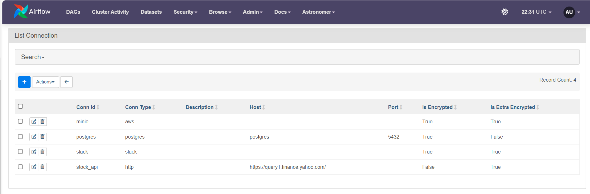
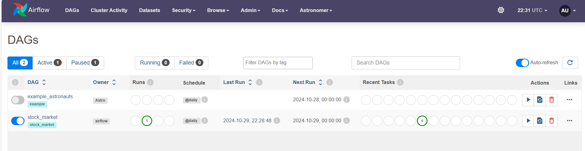
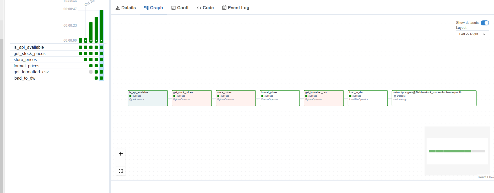
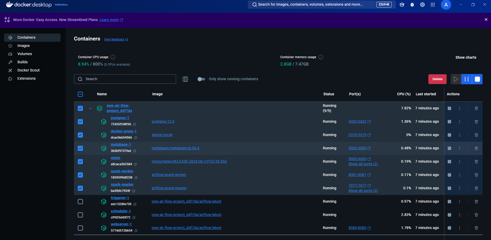
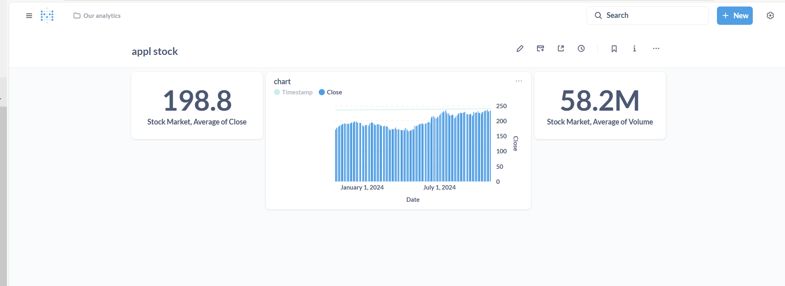
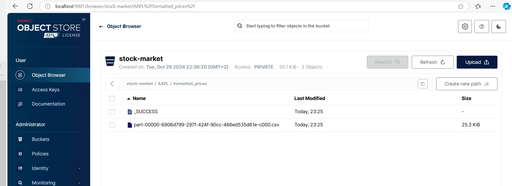
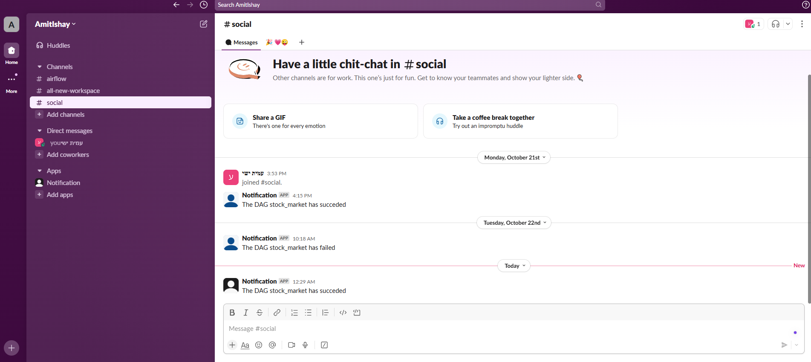

Stock Market Data Pipeline
========

This project is an Apache Airflow data pipeline designed to fetch, process, and store stock market data for a given symbol (in this case, AAPL). The pipeline runs every 4 hours, verifying the availability of the stock API (JSON file of AAPL stock), gathering raw data (all the details about AAPL stock from Yahoo Finance), formatting it, and loading it into a data warehouse.

Project Structure
================

The pipeline consists of two main components:

1. DAG: Manages the orchestration of tasks, schedules, and notifications.
2. Tasks: Defined functions for interacting with external systems, handling data retrieval, processing, and loading.

Main Classes and Functions
===========================

stock_market DAG:

- The DAG is scheduled to run every 4 hours (schedule='0 */4 * * *').
- It uses the SlackNotifier to post success and failure notifications to a Slack channel named social.
- Each task performs specific functions in a sequence, managed by task dependencies.

Tasks Module: The main tasks include:

- _get_stock_prices: Retrieves raw stock data for a specified symbol from the API.
- _store_prices: Saves raw stock data to Minio (an S3-compatible storage).
- _get_formatted_csv: Checks Minio storage for a pre-formatted CSV file and returns the file path.

Prerequisites
=================================

- Python: Python 3.7+
- Docker: Ensure Docker is installed for the DockerOperator.
- Airflow: Apache Airflow configured locally with Astro CLI.
- Astronomer CLI: For local development and testing with Airflow.

DAG Configuration and Tasks
=======

- is_api_available: Checks if the stock API is available.
- get_stock_prices: Calls _get_stock_prices to retrieve stock data for a specified symbol.
- store_prices: Stores the stock data in Minio.
- format_prices: A DockerOperator task that formats stock data.
- get_formatted_csv: Verifies the presence of the formatted CSV in Minio.
- load_to_dw: Loads the formatted CSV data to the data warehouse.

Tasks Function Module (tasks.py)
=======

- _get_minio_client: Initializes the Minio client for accessing the storage bucket.
- _get_stock_prices(url, symbol): Fetches stock prices from the external API.
- _store_prices(stock): Saves stock data as JSON to Minio.
- _get_formatted_csv(path): Searches Minio storage for the formatted CSV file and returns its path.

